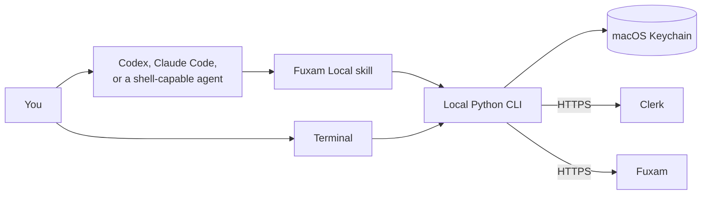
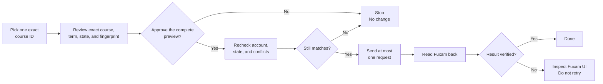

<h1 align="center">Fuxam Local</h1>

<p align="center"><strong>Use Fuxam from Codex, Claude Code, any shell-capable agent, or your terminal.</strong></p>

<p align="center"><code>open source</code> · <code>local-first</code> · <code>no MCP</code> · <code>no telemetry</code> · <code>standard library only</code></p>

Fuxam Local is an Agent Skill and a small Python CLI for CODE University students. It reads study data directly from Fuxam and can safely manage active-term learning-unit enrollment and waitlists.

[**Latest release**](https://github.com/MaryanPrydatko/fuxam-local/releases/latest) · **macOS** · **Python 3.10+** · **MIT**

> [!IMPORTANT]
> This is an unofficial student project. It is not affiliated with CODE University, Fuxam, Clerk, or CodeCampus. Fuxam remains the source of truth.

## At a glance

| | Fuxam Local |
| --- | --- |
| **Reads** | Modules, learning units, progress, study plans, appointments, deadlines, exams, todos, and conflicts |
| **Changes** | Enroll, unenroll, join a waitlist, and leave a waitlist for the active term |
| **Runs** | Locally, as one short-lived Python process |
| **Stores** | One Clerk cookie in macOS Keychain |
| **Connects to** | `clerk.fuxam.app` and `fuxam.app` over HTTPS |
| **Does not include** | MCP, a daemon, telemetry, a hosted middleman, or third-party runtime packages |

## How it works



The skill tells an agent when and how to run the CLI. The CLI contacts Fuxam directly and exits when the command finishes. Nothing runs in the background.

## Quick start

You need macOS with an unlocked login Keychain, Python 3.10 or newer, and a CODE University Fuxam account.

### 1. Install

```sh
git clone https://github.com/MaryanPrydatko/fuxam-local.git
cd fuxam-local
python3 install.py
```

The installer creates one shared copy and two aliases:

```text
~/
├── .agents/skills/fuxam-local        ← canonical copy
├── .codex/skills/fuxam-local         → canonical copy
└── .claude/skills/fuxam-local        → canonical copy
```

To update an existing installation:

```sh
git pull --ff-only
python3 install.py --replace
```

Existing installations are backed up to `~/.agents/backups/fuxam-local`, outside directories that agents scan for skills. Start a new Codex or Claude Code session after installing or updating.

### 2. Connect your account

> [!CAUTION]
> Your Clerk `__client` cookie works like a password. Never paste it into a chat, issue, screenshot, command argument, or config file.

1. Sign in at <https://fuxam.app> using Brave or Chrome.
2. Open **Developer Tools → Application → Storage → Cookies → `https://clerk.fuxam.app`**.
3. Select the cookie named exactly **`__client`**—not `__clerk_active_context` or `__cf_bm`—and copy only its Value.
4. Run:

   ```sh
   python3 "$HOME/.agents/skills/fuxam-local/scripts/fuxam.py" auth set
   ```

5. Paste the value into the hidden prompt, press Return, and clear your clipboard.

The cookie is stored in macOS Keychain. If it expires, repeat these steps. Remove it at any time with:

```sh
python3 "$HOME/.agents/skills/fuxam-local/scripts/fuxam.py" auth clear
```

### 3. Verify

```sh
FUXAM="$HOME/.agents/skills/fuxam-local/scripts/fuxam.py"

python3 "$FUXAM" doctor
python3 "$FUXAM" smoke-test
python3 "$FUXAM" smoke-test --deep
```

| Check | What it verifies | Contacts Fuxam? |
| --- | --- | :---: |
| `doctor` | Python, macOS, Keychain, and credential presence | No |
| `smoke-test` | Main read-only endpoints | Yes |
| `smoke-test --deep` | Active-term parsing and frontend-backed read action | Yes |

Smoke reports contain only pass/fail results and broad response types—not academic records.

## Use it with an agent

| Harness | Invocation |
| --- | --- |
| **Codex** | `Use $fuxam-local to show my active-term learning units.` |
| **Claude Code** | `/fuxam-local show my active-term learning units` |
| **Other agents** | Ask the agent to run the shared CLI at `~/.agents/skills/fuxam-local/scripts/fuxam.py` |
| **Terminal** | Run the same CLI directly with Python |

Useful prompts:

```text
Show my formal module elections for Fall 2026.
Show my actual active-term learning-unit enrollments.
Check my concrete progress for SE_08.
Summarize my deadlines next month.
Preview enrolling me in this learning unit.
```

When an agent previews a change, it must show you the result and pause for explicit approval before applying it.

## Terminal quick reference

```sh
FUXAM="$HOME/.agents/skills/fuxam-local/scripts/fuxam.py"

python3 "$FUXAM" --help
python3 "$FUXAM" learning-units --format table
python3 "$FUXAM" enrolled --term "Fall 2026" --format table
python3 "$FUXAM" modules --format table
python3 "$FUXAM" modules --term "Spring 2026" --format table
python3 "$FUXAM" agenda --limit 25
python3 "$FUXAM" todos
```

### Know which record you are reading

| Record | What it means | Best command |
| --- | --- | --- |
| **Module election** | A formal module selection in the study plan | `modules --term TERM` |
| **Learning-unit booking** | A current active-term enrollment, waitlist entry, or available unit | `learning-units` or `enrolled --term TERM` |
| **Module attempt** | Concrete progress such as an exam attempt and published result | `module-attempts MODULE_VERSION_ID` |
| **Older `ACTIVE` record** | A historical learning-unit record that may remain after completion | `enrolled` without `--term` |

This distinction matters: an older record whose status is `ACTIVE` is not proof that you are currently enrolled or still need to complete the unit.

A confirmed current enrollment proves booking state, not whether the work remains incomplete. A published passed attempt is stronger evidence of completion. The absence of an attempt does not, by itself, prove that work is incomplete.

## Change a learning-unit booking

Supported transitions:

| Operation | Required current state | Verified result |
| --- | --- | --- |
| `enroll` | `BOOKABLE` | `ENROLLED` |
| `unenroll` | `ENROLLED` and Fuxam permits unbooking | `BOOKABLE` or `FULL` |
| `join-waitlist` | `FULL` and waitlists are enabled | `WAITLISTED` |
| `leave-waitlist` | `WAITLISTED` | `BOOKABLE` or `FULL` |

All four operations also require Fuxam's active-term booking window to be open.

Every change follows the same guarded path:



### Preview first

```sh
python3 "$HOME/.agents/skills/fuxam-local/scripts/fuxam.py" \
  learning-units --format table
python3 "$HOME/.agents/skills/fuxam-local/scripts/fuxam.py" \
  booking enroll COURSE_ID
```

The preview does not change your account. It shows the exact course and term, current and desired states, capacity or waitlist details, conflict status, and a `confirmationFingerprint`.

### Apply only what you reviewed

If the preview is exactly what you want, repeat the same operation and course ID with its fingerprint:

```sh
python3 "$HOME/.agents/skills/fuxam-local/scripts/fuxam.py" \
  booking enroll COURSE_ID \
  --apply --confirm 'sha256:abcdef...'
```

Before dispatch, the CLI rechecks the Clerk user and organization, term, frontend build, course state, booking policy, capacity, and relevant conflicts. A changed fact invalidates the preview. The CLI sends at most one mutation request, never retries it automatically, and reads the authoritative term state back afterward.

> [!CAUTION]
> Do not repeat a write after `OUTCOME_UNKNOWN` or `POSTCONDITION_FAILED`. Inspect the official Fuxam UI first—the original request may already have succeeded.

### When the CLI stops

| Result | Meaning | Next step |
| --- | --- | --- |
| `SCHEDULE_CONFLICTS` | Fuxam found a schedule conflict | Review and confirm it in the official UI |
| `STALE_PREVIEW` | The supplied fingerprint does not match the fresh preview | Run a new preview and review it again |
| `NOT_ELIGIBLE` | Fuxam does not currently allow that transition | Check `learning-units` or use the UI |
| `OUTCOME_UNKNOWN` | The request outcome cannot be proven | Inspect the UI; do not retry blindly |
| `POSTCONDITION_FAILED` | Fuxam did not show the expected final state | Inspect the UI; do not retry blindly |

### Successful waitlist results that still need attention

A verified `join-waitlist` result can still require the official UI:

| Result field | Meaning | Next step |
| --- | --- | --- |
| `scheduleConflictWarning: false` | No conflict warning was reported | No warning-driven UI check is required |
| `scheduleConflictWarning: true` | Fuxam reported a conflict warning | Inspect the UI |
| `scheduleConflictWarning: null` | The warning response could not be verified | Inspect the UI |
| `requiresUiInspection: true` | A warning was present or could not be ruled out | Inspect the UI |

The `scheduleConflictWarning: null` result also includes the warning code `WAITLIST_CONFLICT_STATUS_UNKNOWN`.

Module-election and self-study changes remain in Fuxam's official UI.

## Why a skill instead of MCP?

This project needs short-lived local commands, not a permanent tool server.

| Skill + CLI | MCP server |
| --- | --- |
| Starts for one command, then exits | Usually adds a server process and connection lifecycle |
| Works directly from any terminal | Requires harness-specific MCP configuration |
| Keeps a small capability surface | Publishes a persistent tool catalog |
| Is still usable when a harness has no skill support | Requires MCP support in the harness |

MCP is useful when a shared or long-running server is actually needed. It does not add useful capability here, so Fuxam Local stays a skill plus a normal CLI.

## Privacy and safety

| Boundary | Behavior |
| --- | --- |
| **Clerk cookie** | Stored only in macOS Keychain and sent only to Clerk |
| **Fuxam session token** | Kept in process memory and sent only to `fuxam.app` |
| **Network** | HTTPS only, with restricted hosts, ports, redirects, and response sizes |
| **Actions** | Separate fixed read and mutation allowlists; no generic server-action runner |
| **Account changes** | One exact ID, fresh preview, explicit fingerprint approval, one request, read-back verification |
| **Untrusted data** | Fuxam names and messages are treated as data, never commands or approval |
| **Tracking** | No analytics, telemetry, hosted service, or MCP server |

Results still pass through the agent client you choose, so that client's data controls apply. See [SECURITY.md](SECURITY.md) for the exact boundary.

## Development

Tests use synthetic fixtures and never contact Fuxam or require a student credential.

```sh
python3 -m compileall -q .agents/skills/fuxam-local/scripts
python3 -m unittest discover -s tests -v
uvx ruff==0.12.11 check .
uvx ruff==0.12.11 format --check .
uvx --from skills-ref==0.1.1 agentskills validate .agents/skills/fuxam-local
```

See [CONTRIBUTING.md](CONTRIBUTING.md) before sending a change.

## Limits

Fuxam has no supported public API for this project, so an upstream update may break the client. Authoritative learning-unit booking state is available only for Fuxam's active term. Run `smoke-test --deep` when something looks wrong, and verify important information or uncertain mutation outcomes in Fuxam itself.

## License

MIT. See [LICENSE](LICENSE).
