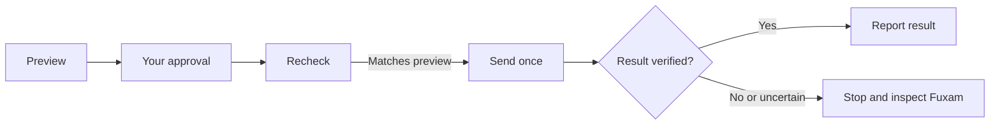

# Fuxam Local

A CLI and agent skill for CODE University's Fuxam. Read courses, study progress
and schedules; enroll, unenroll, or manage waitlists for the active term.

Requires Python 3.10+. Uses the standard library and your OS credential store.
No MCP server or telemetry. Unofficial; Fuxam's private API can change.

| System | Credential storage | Setup |
| --- | --- | --- |
| macOS | Keychain | Built in |
| Linux | Secret Service | `secret-tool` and an unlocked desktop keyring |
| Windows | Credential Manager | Built in; no administrator access needed |

Linux: on Ubuntu/Debian, install `libsecret-tools`; a Secret Service provider
such as GNOME Keyring must also be running. WSL needs the same Linux setup.
There is no `.env` or plaintext fallback for machines without a keyring.

## Install

On Windows, use `py -3` wherever the examples show `python3`.

```sh
git clone https://github.com/MaryanPrydatko/fuxam-local.git
cd fuxam-local
python3 install.py
```

Installs to `~/.agents/skills/fuxam-local`, with Codex and Claude aliases
(copies on Windows, symlinks elsewhere).
To update from the checkout:

```sh
git pull --ff-only
python3 install.py --replace
```

Previous copies are backed up under `~/.agents/backups/fuxam-local`.
Start a new agent session after installing.

## Sign in

Sign in to [Fuxam](https://fuxam.app) and copy the `__client` cookie value from
`clerk.fuxam.app`. Treat it like a password: never put it in chat, screenshots,
shell arguments, environment variables, or files.

```sh
FUXAM="$HOME/.agents/skills/fuxam-local/scripts/fuxam.py"
```

In Windows PowerShell, set the path with:

```powershell
$FUXAM = "$env:USERPROFILE/.agents/skills/fuxam-local/scripts/fuxam.py"
```

Then sign in and check the connection:

```sh
python3 "$FUXAM" auth set
python3 "$FUXAM" smoke-test
```

Paste only into the hidden terminal prompt. The cookie stays in your OS store.
See [authentication](.agents/skills/fuxam-local/references/authentication.md)
for browser steps, renewal, and removal.

## Use

```sh
python3 "$FUXAM" learning-units --format table
python3 "$FUXAM" enrolled --term "Fall 2026" --format table
python3 "$FUXAM" modules --term "Fall 2026" --format table
python3 "$FUXAM" agenda --limit 25
```

Output is JSON by default. Run `python3 "$FUXAM" --help` for all commands.
Live learning-unit enrollments are available for the active term only.
An enrollment does not prove unfinished work; use module attempts for progress.
See [usage](docs/usage.md) for record types and failure handling.

In Codex: `Use $fuxam-local to show my active-term learning units.`
In Claude Code: `/fuxam-local show my active-term learning units`.
Other shell-capable agents should read the installed `SKILL.md` before use.

## Booking



Get the exact course ID from `learning-units`, then preview the change:

```sh
python3 "$FUXAM" booking enroll COURSE_ID
```

Review the course, term, states, capacity, conflicts, and fingerprint.
After explicit approval of that preview:

```sh
python3 "$FUXAM" booking enroll COURSE_ID --apply --confirm 'sha256:...'
```

Also supports `unenroll`, `join-waitlist`, and `leave-waitlist`.
Each apply rechecks the preview, sends at most one change, and reads the result
back. On `OUTCOME_UNKNOWN` or `POSTCONDITION_FAILED`, stop and inspect Fuxam's UI;
do not retry automatically. Waitlist warnings may also need UI inspection.

Module elections and self-study changes stay in Fuxam's UI.
See [booking details](docs/usage.md#booking) and [security](SECURITY.md).

## Contributing

See [CONTRIBUTING.md](CONTRIBUTING.md) for checks and
[CHANGELOG.md](CHANGELOG.md) for changes. [Releases](https://github.com/MaryanPrydatko/fuxam-local/releases)
include the source and installer.

Inspired by Maximilian Spitzer's [Fuxam Student MCP](https://codecampus.tools/docs/fuxam-student-mcp).
Independently implemented as a local CLI and agent skill.

[MIT license](LICENSE). [Project notice](NOTICE.md).
