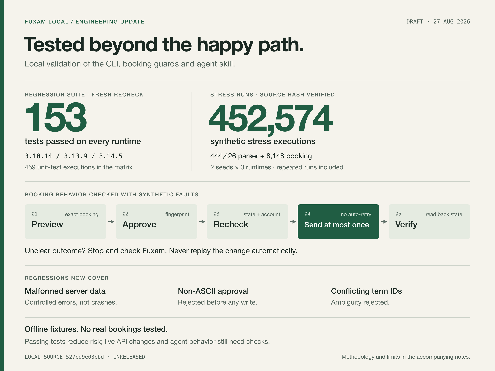

# Fuxam Local: testing update

27 August 2026 · Validation snapshot · Unreleased changes



## Copy to share

Small engineering update on Fuxam Local, my local CLI + skill for using Fuxam from a terminal or a shell-capable agent.

Testing caught some real bugs: malformed server data could produce unhandled errors, a non-ASCII booking confirmation could crash, and conflicting term IDs needed to be rejected. Those cases now have regression coverage.

The current local build passes **153 tests on each of three Python versions**. The recorded stress runs add **452,574 synthetic executions**: 444,426 parser checks and 8,148 booking scenarios. That includes repeated runs across two seeds and three runtimes—not 452,574 unique tests.

The booking checks exercise the failure paths: invalid confirmations must not send a change, a scenario must never make more than one write attempt, and an uncertain result must stop for verification instead of being retried automatically.

This is offline evidence, not a bug-free promise. No real bookings were changed. Live Fuxam behavior and agent approval handling still need end-to-end checks. These hardening changes have not been released yet.

## What the numbers mean

| Check | Recorded result |
| --- | --- |
| Unit suite, freshly rerun | 153 passed on Python 3.10.14, 3.13.9 and 3.14.5; 459 executions, no failures, errors or skips |
| Parser stress | 74,071 calls × 2 seeds × 3 runtimes = 444,426 executions |
| Booking stress | 1,358 scenarios × 2 seeds × 3 runtimes = 8,148 executions |
| Additional CLI regressions | 12 checks rejected a non-ASCII confirmation with controlled `STALE_PREVIEW` output and no mutation calls |
| Local quality checks, freshly rerun | Compile, Ruff lint/format and skill validation passed; installed skill files match the repository |

The stress results were audited against the current source fingerprint, not rerun during this final recheck. Seeds: `0xF17E2026` and `0xA11CE2026`. The 452,574 total excludes the unit suite and additional CLI checks. Repetition occurs across runtimes, seeds and cases; no distinct-input count was measured.

Synthetic fixtures and mocked/guarded external access were used. Stress reports were checked for failures and unexpected findings, not just successful process exits. A known JWT Unicode edge case remains: the decoder accepts lone surrogate code points. That is an interoperability observation, not a failing assertion in these runs; it still needs consideration when assessing compatibility.

Term probes also confirmed that `Fall 2026`, `fall semester 2026` and `FS26` resolve to `FS26`. `Spring 2026` and `SS26` resolve to `SS26`. Bare `fall` and `Spring2026` without a space are rejected rather than guessed.

This does not establish live authentication, native Keychain integration, real enrollment/waitlist behavior, every agent's consent handling, or compatibility with future Fuxam changes.

## Repeat the repository checks

Run from the repository root:

```sh
python3 -m compileall -q .agents/skills/fuxam-local/scripts
python3 -m unittest discover -s tests -v
uvx ruff==0.12.11 check .
uvx ruff==0.12.11 format --check .
uvx --from skills-ref==0.1.1 agentskills validate .agents/skills/fuxam-local
git diff --check
```

Repeat the Python checks with each interpreter to reproduce the unit matrix. These commands do not reproduce the one-off stress harness runs. The final recheck used already-cached validators; `uvx` may download them on a fresh machine.

Validated CLI source SHA-256:

```text
527cd9e03cbd6f2b79d7fe1de0e8d5f06b6b8ecf03ab34873250f2a39dbd75c7
```

[Shareable PNG](2026-08-27-testing.png) · [Editable SVG](2026-08-27-testing.svg)
